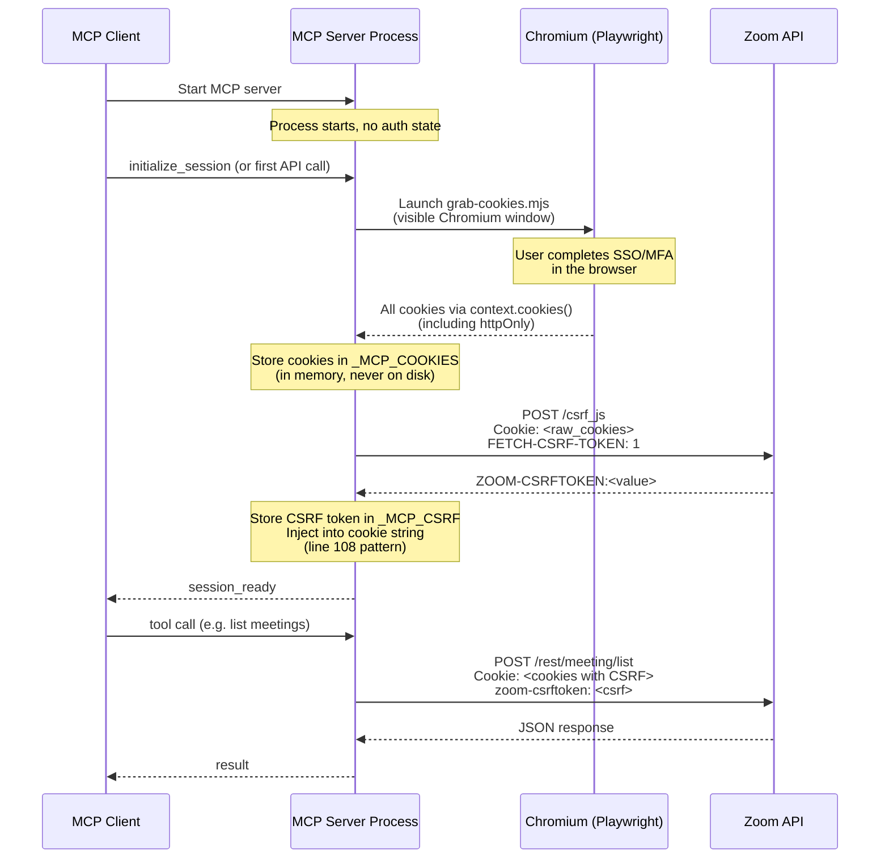

# MCP Session Lifecycle Design

Ephemeral in-memory auth/session lifecycle for the zoom-cli MCP wrapper.

## Overview

When zoom-cli runs as an MCP server, all authentication state (cookies + CSRF token) lives exclusively in process memory. Nothing touches disk. The session is scoped to a single MCP server process and dies with it.

## Credential Surface

A working session requires two pieces of state:

| Secret | Source | Current storage | MCP storage |
|---|---|---|---|
| Raw cookie string | `grab-cookies.mjs` or `set-cookies` command | `.raw_cookies` file (line 16) | Shell variable in memory |
| CSRF token | `POST /csrf_js` with `FETCH-CSRF-TOKEN: 1` header (`cmd_refresh_csrf`, line 71) | `.csrf_token` file (line 17) | Shell variable in memory |

The CSRF token is also injected into the cookie string as `ZOOM-CSRFTOKEN=<value>` (line 108).

**Important**: The CSRF endpoint returns a valid-looking token even with stale cookies. It cannot be used as a session health check.

## Session Initialization Sequence



### ASCII Sequence (for terminals without Mermaid)

```
MCP Client          MCP Server Process       Chromium (Playwright)    Zoom API
    |                      |                      |                      |
    |-- start server ----->|                      |                      |
    |                      | (no auth state)      |                      |
    |                      |                      |                      |
    |-- init / first call->|                      |                      |
    |                      |-- grab-cookies.mjs ->|                      |
    |                      |   (visible browser)  |                      |
    |                      |        User completes SSO/MFA               |
    |                      |<- context.cookies() -|                      |
    |                      |  (incl. httpOnly)     |                      |
    |                      |                      |                      |
    |                      |-- POST /csrf_js ---->|                      |
    |                      |   Cookie: <raw>      |                      |
    |                      |   FETCH-CSRF-TOKEN:1 |                      |
    |                      |<------------- CSRFTOKEN:val ----------------|
    |                      |                      |                      |
    |                      | cookies + csrf       |                      |
    |                      | held in memory only  |                      |
    |                      |                      |                      |
    |<-- session_ready ----|                      |                      |
    |                      |                      |                      |
    |-- list meetings ---->|                      |                      |
    |                      |-- POST /rest/... --->|                      |
    |                      |<------------- JSON response ----------------|
    |<-- result -----------|                      |                      |
```

## In-Memory Secret Storage

In MCP mode, the shell functions `get_cookies` and `get_csrf` must read from variables instead of files. The design replaces the file-backed approach with two process-scoped variables:

```bash
# MCP mode: secrets held in shell variables, never on disk
_MCP_COOKIES=""    # replaces reading from $RAW_COOKIE_FILE
_MCP_CSRF=""       # replaces reading from $CSRF_FILE
```

Functions that currently do `cat "$RAW_COOKIE_FILE"` (line 35) and `cat "$CSRF_FILE"` (line 119) will check an `MCP_MODE` flag and read from these variables instead. No changes are needed to `zoom_get`, `zoom_post`, or other curl wrappers -- they already call `get_cookies`/`get_csrf` indirectly.

### No File-Based Secret Dependency

In MCP mode:
- `RAW_COOKIE_FILE` and `CSRF_FILE` are never read from or written to
- `cmd_set_cookies` stores into `_MCP_COOKIES` instead of `printf '%s' "$raw" > "$RAW_COOKIE_FILE"`
- `cmd_refresh_csrf` stores into `_MCP_CSRF` and updates `_MCP_COOKIES` instead of writing files
- The `grab-cookies.mjs` browser flow is launched by the server on demand to capture cookies interactively

## Session Start Flow

1. MCP client starts the server process (e.g., `zoom-cli.sh mcp-serve`)
2. On first API call (or explicit `initialize_session` tool call), the server launches `grab-cookies.mjs` which opens a visible Chromium window for SSO
3. User completes SSO/MFA in the browser
4. Playwright captures all cookies (including httpOnly) via `context.cookies()`
5. Server stores cookies in `_MCP_COOKIES` (in memory, never on disk)
6. Server calls the CSRF refresh logic (`cmd_refresh_csrf` pattern, lines 71-114):
   - `POST /csrf_js` with the `FETCH-CSRF-TOKEN: 1` header
   - Extracts token from `ZOOM-CSRFTOKEN:<value>` response
   - Stores in `_MCP_CSRF`
   - Injects `ZOOM-CSRFTOKEN=<value>` into `_MCP_COOKIES` (line 108 pattern)
7. Server confirms readiness to client

The MCP server owns the entire auth flow -- the client never touches raw cookies. The session is process-scoped: it exists only within this process and its environment.

## Session Termination Behavior

The session ends when any of the following occur:

| Trigger | Behavior | Secrets |
|---|---|---|
| Process exit (normal) | Shell variables freed by OS | Gone |
| Process exit (crash/signal) | Same -- kernel reclaims memory | Gone |
| Terminal close | SIGHUP propagates, process exits | Gone |
| MCP client disconnect | Server stdin closes, process exits | Gone |

There is no cleanup hook needed. Shell variables are process-local and vanish on exit. No files to delete, no temp directory to sweep.

## Idle Timeout (Optional)

Optional idle timeout via `MCP_IDLE_TIMEOUT` env var (default: disabled). When set, the server exits after N seconds of inactivity. Process exit triggers normal cleanup (see Session Termination Behavior above).

## Session Health and Auth Expiry

### Detection

Session health is checked using `is_auth_expired()` (lines 130-142), which pattern-matches API responses for:

| Pattern | Meaning |
|---|---|
| `"errorCode":201` | Session invalid |
| `"User not login"` | Session invalid |
| `login.microsoftonline.com` or `SAMLRequest` | SAML redirect (SSO re-auth needed) |
| `<title>Error - Zoom</title>` | Generic Zoom error page |

This detection runs after every API call via `zoom_authed` (line 162).

### Recovery in MCP Mode

`do_reauth()` (line 145) checks `[[ -t 0 && -t 1 ]]` for an interactive terminal. MCP is always non-interactive, so automatic re-authentication is impossible.

When auth expires:
1. `zoom_authed` detects expiry via `is_auth_expired()`
2. `do_reauth` fails (non-interactive)
3. Server returns a structured error to the MCP client:

```json
{
  "error": "session_expired",
  "message": "Zoom session has expired. Call initialize_session to re-authenticate.",
  "recovery": "Re-run initialize_session to launch browser SSO and capture fresh cookies"
}
```

4. The MCP process remains alive -- the client can call initialize_session to re-launch browser SSO without restarting the server

### Proactive Health Check (Proposed)

> **Status**: Proposed -- not yet in the tool contract. If adopted, add to `mcp-contract.md`.

A dedicated `session_status` tool would expose current session health:
- Calls a lightweight Zoom endpoint (e.g., `GET /meeting`)
- Runs the response through `is_auth_expired()`
- Returns `{ "status": "healthy" }` or `{ "status": "expired", ... }`

Note: Do not use `/csrf_js` for health checks -- it returns valid-looking tokens even with stale cookies.

## State Diagram

```
                    ┌─────────────┐
                    │   No Auth   │
                    └──────┬──────┘
                           │ initialize_session
                           ▼
                    ┌─────────────┐
                    │  Fetching   │
                    │   CSRF      │
                    └──────┬──────┘
                           │ success
                           ▼
              ┌───────────────────────┐
         ┌───>│        Active         │<───┐
         │    └───┬───────────┬───────┘    │
         │        │           │            │
         │  API call     idle timeout   re-init
         │   fails     or process exit  (browser SSO)
         │        │           │            │
         │        ▼           ▼            │
         │  ┌──────────┐  ┌────────┐       │
         │  │ Expired  │  │  Dead  │       │
         │  └─────┬────┘  └────────┘       │
         │        │                        │
         │        └────────────────────────┘
         │          initialize_session
         │
         └── API call succeeds (stay Active)
```

## Summary of Guarantees

1. **No disk secrets in MCP mode** -- cookies and CSRF token live only in shell variables
2. **Process-scoped** -- session cannot leak to other processes or persist after exit
3. **Expiry-aware** -- reuses existing `is_auth_expired()` patterns from `zoom-cli.sh`
4. **Recoverable without restart** -- server re-launches browser SSO on re-initialize
5. **Optionally time-bounded** -- idle timeout prevents stale sessions from lingering
